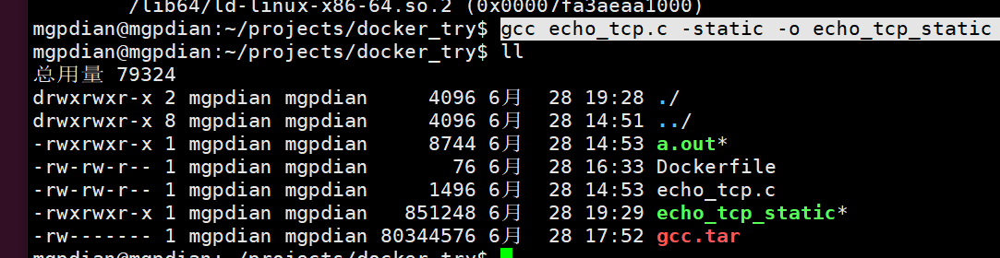
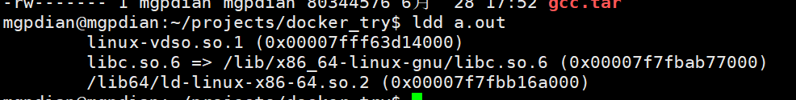
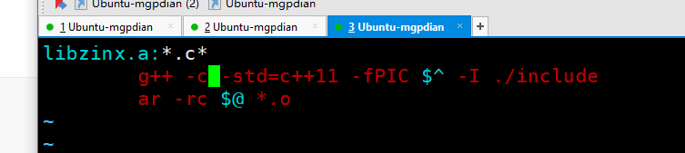
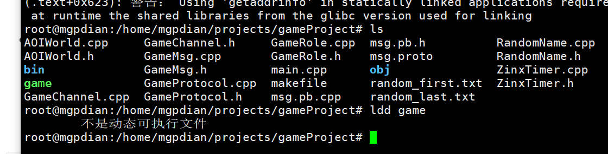

# 6 将游戏服务器放到容器中运行

**需求拆解：** 在容器中运行游戏服务器总共分三步：

1. 为游戏服务器创建环境可用的镜像
2. 把游戏服务器作为容器执行点并开放端口映射
3. 以守护进程模式运行镜像

> 问题: 如何查看程序依赖的动态库
>
> ```hash
> ldd 程序名
> ```
>
> 

**问题1**：环境可用？我们的游戏服务器有哪些依赖？怎么解决

**解决方案：**

- 基于纯净ubuntu安装zinx库，安装protobuf (但这样的化 容器的内存就会变大 而且安装麻烦)
- **静态编译游戏服务器**（推荐）

##### 关于静态编译 

只需要在编译时 添加-static 就可以了

```c++
gcc echo_tcp.c -static -o echo_tcp_static
```



会发现静态编译的非常大

同时 关于他们需要的连接




发现静态编译不需要连接 因为它把连接的都放进去了


**问题2**：端口映射到哪个宿主机端口？映射端口时，宿主机端口会不会被占用？

**解决方案：** run容器时使用-P配合dockerfile里的EXPOSE随机分配端口。

### 2.6.1. 步骤1 静态编译游戏服务器

- 修改zinx框架的Makefile，构建静态zinx库：libzinx.a

```Makefile
libzinx.a:*.c*
        g++ -c -std=c++11 -fPIC $^ -I ./include 
        ar -rc $@ *.o

```



编译成功后 将libzinx.a拷贝到  cp libzinx.a /usr/lib/libzinx.a

```c++

game:*.cpp /usr/lib/libzinx.a /usr/lib/libprotobuf.a /usr/local/lib/libhiredis.a
        g++ -pthread -std=c++11 -g -Wall $^ -o $@ -lpthread
    
    //这种方法失败了 因为没有libprotobuf.a 不知道去哪找
    
    
game:*.cpp
    g++ -g -std=c++11 -pthread -Wl,--whole-archive -lpthread -Wl,--no-whole-archive $^ -o $@ -lprotobuf -lzinx -pthread -lhiredis-static
```


测试使用静态链接的 动态编译是否成功



- 修改游戏服务器的Makefile，使用静态编译
  - -static关键字表示静态编译。链接时会链接.a文件
  - -Wl,--whole-archive -lpthread -Wl,--no-whole-archive参数是为了解决gcc的一个bug，没有这一串参数时，pthread库的静态编译会有问题。

```Makefile
game:*.cpp
    g++ -g -std=c++11 -pthread -Wl,--whole-archive -lpthread -Wl,--no-whole-archive $^ -o $@ -lprotobuf -lzinx -pthread -static
```

此时，只要是64位linux系统，都可以运行该程序。

### 2.6.2. 步骤2 编写Dockerfile

基于ubuntu基础镜像，拷贝游戏服务器程序和相关文件;向外暴露8899端口;设定执行点为游戏服务器进程。


```
这个后面会修改 可以不写
FROM ubuntu
WORKDIR /root/   //这个为指定 运行路径
EXPOSE 8899
COPY game random* ./
CMD ["debug"]
ENTRYPOINT ["./game"]
```

完整版

```c++
FROM ubuntu
WORKDIR /root/ #指定运行路径
COPY game /root/
COPY game_start.sh /root/
COPY random_first.txt /root/
COPY random_last.txt /root/
EXPOSE 51111 #要关联的端口
ENTRYPOINT ["./game_start.sh"]
```


但是 这样运行的话  如果游戏服务器中启动了守护进程 (他就会杀死父进程 , 而docker的运行是如果父进程结束 那容器就运行结束)

所以我们需要编写一个  无需循环脚本 来保持容器不退出

game_start.sh

```bash
#!/bin/bash
        
./game  
        
while [ a == a ]
do              
        sleep 10
        ps aux | grep -w game | grep -v grep  #-w 表示要搜索名字完全符合的进程  -v 过滤掉grep
        
        if [ 0 -ne $? ] #$? 是 访问上一条命令是否成功 0是成功 1是失败
        then
                exit 0
        fi
done
```

编写后 没用权限执行 需要给脚本添加权限

```bash
chmod 755 game_start.sh
```


#### 游戏进程的启动脚本

- 首行#!/bin/bash
- 启动游戏服务的命令(./game)
- 死循环查询game进程是否存在
- 不存在则退出脚本


## Dockerfile 完整版

```bash
FROM ubuntu
WORKDIR /root/ #指定运行路径
COPY game /root/
COPY game_start.sh /root/
COPY random_first.txt /root/
COPY random_last.txt /root/
EXPOSE 51111 #要关联的端口
ENTRYPOINT ["./game_start.sh"]
```


### 2.6.3. 步骤3 测试

1. 编译镜像
2. 运行镜像，-d指定守护运行，-P指定端口随机映射
3. 查看该容器映射的端口号，启动游戏测试

```bash
$ docker build  -t game_run .
$ docker run -P -d game_run  #-d 为 守护线程 -P 大写P为随机端口 配合 sh脚本中的EXPOSE的关联端口 来实现端口绑定
$ docker ps -a
CONTAINER ID        IMAGE               COMMAND             CREATED             STATUS              PORTS                     NAMES
f8d541bc7917        game_run            "./game debug"      6 minutes ago       Up 6 minutes        0.0.0.0:32768->8899/tcp   confident_spence
```

用32768端口启动游戏客户端，测试OK

