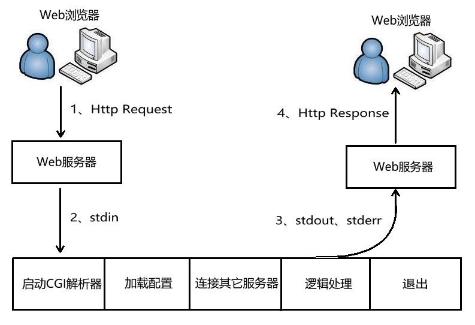
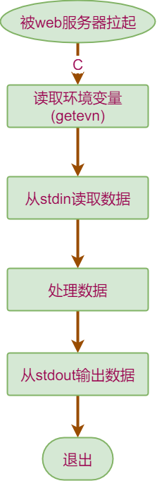
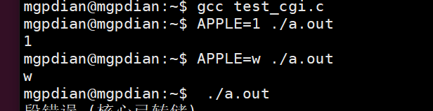
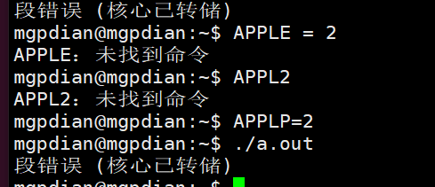

# 12 CGI

nignx无法处理 网页发送过来的动态数据  所以需要FastCgi来处理

Nignx配置FastCGI 

- 目的: 跟客户端数据交互

## 为此首先我们就要了解CGI

###  CGI

**简介**

通用网关接口(Common Gateway Interface、CGI)描述了客户端和服务器程序之间传输数据 的一种标准，可以让一个客户端，从网页浏览器向执行在网络服务器上的程序请求数据。 CGI独立于任何语言的，CGI 程序可以用任何脚本语言或者是完全独立编程语言实现，只要这个语言可以在这个系统上运行。Unix shell script、Python、 Ruby、PHP、 perl、Tcl、 C/C++和 Visual Basic 都可以用来编写 CGI 程序。

最初，CGI 是在 1993 年由美国国家超级电脑应用中心(NCSA)为 NCSA HTTPd Web 服务 器开发的。这个 Web 服务器使用了 UNIX shell 环境变量来保存从 Web 服务器传递出去的参数，然后生成一个运行 CGI 的独立的进程。

**CGI处理流程**

1. **web服务器收到客户端(浏览器)的请求Http Request，启动CGI程序，并通过环境变量、标准输入传递数据**
2. **CGI进程启动解析器、加载配置(如业务相关配置)、连接其它服务器(如数据库服务器)、逻辑处理等**
3. **CGI进程将处理结果通过标准输出、标准错误，传递给web服务器**
4. **web服务器收到CGI返回的结果，构建Http Response返回给客户端，并杀死CGI进程**



web服务器与CGI通过环境变量、标准输入、标准输出、标准错误互相传递数据。在遇到用户连接请求：

- 先要创建CGI子进程，然后CGI子进程处理请求，处理完事退出这个子进程：fork-and-execute
- CGI方式是客户端有多少个请求，就开辟多少个子进程，每个子进程都需要启动自己的解释器、加载配置，连接其他服务器等初始化工作，这是CGI进程性能低下的主要原因。当用户请求非常多的时候，会占用大量的内存、cpu等资源，造成性能低下。

CGI使外部程序与Web服务器之间交互成为可能。CGI程序运行在独立的进程中，并对每个Web请求建立一个进程，这种方法非常容易实现，但效率很差，难以扩展。面对大量请 求，进程的大量建立和消亡使操作系统性能大大下降。此外，由于地址空间无法共享，也限 制了资源重用。


- 请求头：web服务器设定环境变量们传递给cgi程序，CGI程序通过getenv函数获取
- 请求的身体：web服务器直接将身体的字符串传递给cgi程序的标准输入

**环境变量** GET请求，它将数据打包放置在环境变量QUERY_STRING中，CGI从环境变量 QUERY_STRING中获取数据。

常见的环境变量如下表所示：

| 环境变量          | 含义                                                         |
| ----------------- | ------------------------------------------------------------ |
| AUTH_TYPE         | 存取认证类型                                                 |
| CONTENT_LENGTH    | 由标准输入传递给CGI程序的数据长度，以bytes或字元数来计算     |
| CONTENT_TYPE      | 请求的MIME类型                                               |
| GATEWAY_INTERFACE | 服务器的CGI版本编号                                          |
| HTTP_ACCEPT       | 浏览器能直接接收的Content-types, 可以有HTTP Accept header定义 |
| HTTP_USER_AGENT   | 递交表单的浏览器的名称、版本和其他平台性的附加信息           |
| HTTP_REFERER      | 递交表单的文本的URL，不是所有的浏览器都发出这个信息，不要依赖它 |
| PATH_INFO         | 传递给CGI程序的路径信息                                      |
| QUERY_STRING      | 传递给CGI程序的请求参数，也就是用"?"隔开，添加在URL后面的字串 |
| REMOTE_ADDR       | client端的host名称                                           |
| REMOTE_HOST       | client端的IP位址                                             |
| REMOTE_USER       | client端送出来的使用者名称                                   |
| REMOTE_METHOD     | client端发出请求的方法(如get、post)                          |
| SCRIPT_NAME       | CGI程序所在的虚拟路径，如/cgi-bin/echo                       |
| SERVER_NAME       | server的host名称或IP地址                                     |
| SERVER_PORT       | 收到request的server端口                                      |
| SERVER_PROTOCOL   | 所使用的通讯协定和版本编号                                   |
| SERVER_SOFTWARE   | server程序的名称和版本                                       |

**标准输入** 环境变量的大小是有一定的限制的，当需要传送的数据量大时，储存环境变量的空间可能会 不足，造成数据接收不完全，甚至无法执行CGI程序。

因此后来又发展出另外一种方法：POST，也就是利用I/O重新导向的技巧，让CGI程序可以由stdin和stdout直接跟浏览器沟通。

当我们指定用这种方法传递请求的数据时，web服务器收到数据后会先放在一块输入缓冲区 中，并且将数据的大小记录在CONTENT_LENGTH这个环境变量，然后调用CGI程序并将 CGI程序的stdin指向这块缓冲区，于是我们就可以很顺利的通过stdin和环境变数CONTENT_LENGTH得到所有的信息，再没有信息大小的限制了。

**CGI程序结构**



### 测试

cgi的环境变量读取功能

```c++
//test_cgi.c
#include <stdio.h>
#include <stdlib.h>

int main()
{       
        puts(getenv("APPLE")); //getenv 为 读取环境变量APPLE
        
}  
```



我们可以看到 每次运行环境变量都会重置



环境变量无法存储  

只能在运行时添加到命令行


### 缺点

CGI程序缺点: 资源消耗大, 某些初始化操作冗余 因为CGI运行会生成一个进程

### CGI程序处理流程

- 程序员自己写程序处理各种业务
- CGI程序的输入来自web服务器（标准输入和环境变量）
- web服务器会将http报文按照CGI标准转换后传递给CGI程序
- CGI程序返回http数据给web服务器（标准输出）
- 请求头：web服务器设定环境变量们传递给cgi程序，CGI程序通过getenv函数获取
- 请求的身体：web服务器直接将身体的字符串传递给cgi程序的标准输入