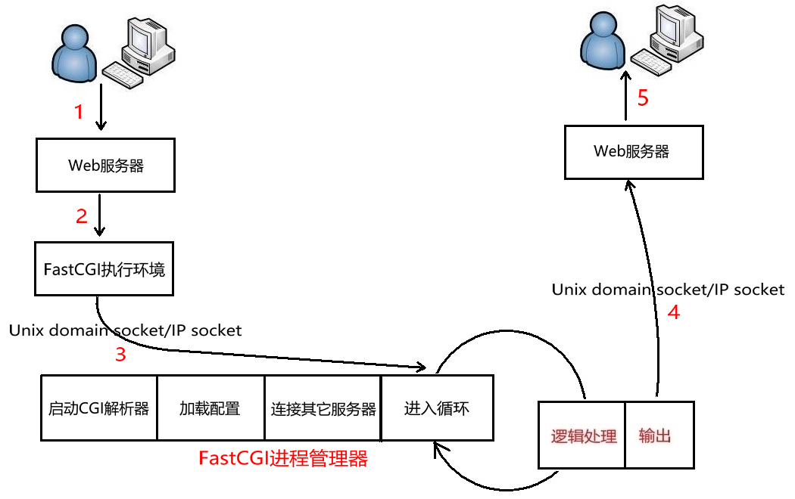
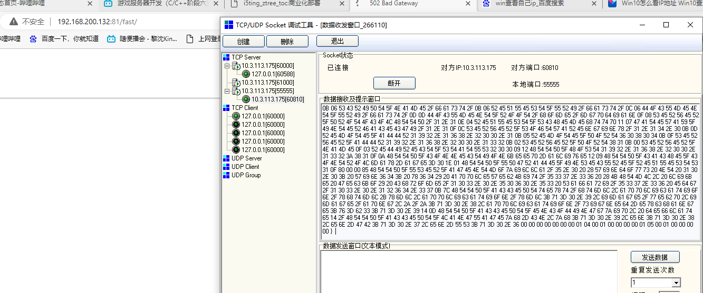

# 13 FastCGI

**什么是FastCGI**

快速通用网关接口(Fast Common Gateway Interface／FastCGI)是通用网关接口(CGI)的改进，描述了客户端和服务器程序之间传输数据的一种标准。

FastCGI致力于减少Web服务器与CGI程式之间互动的开销，从而使服务器可以同时处理更多的Web请求。与为每个请求创建一个新的进程不同，FastCGI使用持续的进程来处理一连串的请求。这些进程由FastCGI进程管理器管理，而不是web服务器。

**FastCGI处理流程**

1. Web 服务器启动时载入初始化FastCGI执行环境。 例如IIS、ISAPI、apache mod_fastcgi、nginx ngx_http_fastcgi_module、lighttpd mod_fastcgi。
2. FastCGI进程管理器自身初始化，启动多个CGI解释器进程并等待来自Web服务器的连接。启动FastCGI进程时，可以配置以ip和UNIX 域socket两种方式启动。
3. 当客户端请求到达Web 服务器时， Web 服务器将请求采用socket方式转发FastCGI主进程，FastCGI主进程选择并连接到一个CGI解释器。Web 服务器将CGI环境变量和标准输入发送到FastCGI子进程。
4. FastCGI子进程完成处理后将标准输出和错误信息从同一socket连接返回Web 服务器。当FastCGI子进程关闭连接时，请求便处理完成。
5. FastCGI子进程接着等待并处理来自Web 服务器的下一个连接。



由于FastCGI程序并不需要不断的产生新进程，可以大大降低服务器的压力并且产生较高的应用效率。它的速度效率最少要比CGI 技术提高 5 倍以上。它还支持分布式的部署，即 FastCGI 程序可以在web 服务器以外的主机上执行。

CGI 是所谓的短生存期应用程序，FastCGI 是所谓的长生存期应用程序。FastCGI 像是一个常驻(long-live)型的CGI，它可以一直执行着，不会每次都要花费时间去fork一次(这是CGI最为人诟病的fork-and-execute 模式)。


```c++
server{
                root /home/mgpdian;
                listen 81;
                location /{
                        index  itcast.html;

                }
                location /mm/{
                        index http://www.baidu.com/;
                }
                location /11/{
                        proxy_pass http://www.sina.com/;
                }
                location /fast/{
                        include /etc/nginx/fastcgi_params;
                        fastcgi_pass 192.168.200.132:55555;
                }
        }

```

include 为导入 nginx中的fastcgi配置

fastcgi_pass 为转发CGI到什么地方 可以是端口 也可以是其他服务器

```c++
location /fast/{
                        include /etc/nginx/fastcgi_params;
                        fastcgi_pass 192.168.200.132:55555;
                }
```

在转发的端口或者服务器 我们可以接受到CGI格式的数据



FastCGI程序处理

-  CGI程序缺点：资源消耗大，某些初始化操作冗余
- FastCGI：一共启一个进程，通过socket接收和回复web服务器传来的请求
- 数据是基于FastCGI标准编码过的二进制数据


