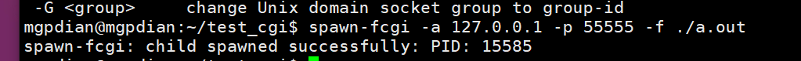
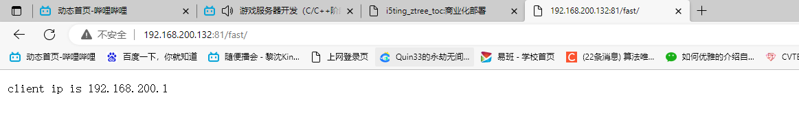

# 14 FCGI库 结合SpawnFCGI

FCGI库 [安装](G:\笔记\游戏服务器\笔记\软件安装)


## **FastCGI程序结构**


## **FCGI库和spawn-cgi**


上图可以看出，fast-cgi程序和cgi程序的相似度很大，但又不完全相同。fcgi库的出现统一了两者。

fcgi是开发FastCGI程序常用的一个函数库：https://github.com/FastCGI-Archives/fcgi2.git

- fcgi库把socket数据收发和编结FastCGI数据封装成函数。方便开发者着眼于业务处理。
- fcgi库在解析完FastCGI数据后会将模拟CGI的规范，设置环境变量和重定向标准输入。
- 利用fcgi编写的程序也可以当做cgi程序运行。

这个fastcgi程序完成了一个返回客户端IP地址的功能。

```c
#include <stdlib.h>
#include <fcgi_stdio.h>

int main()
{
    while (FCGI_Accept() >= 0)
    {
        printf("Content-Type:text\r\n\r\n");
        printf("clint ip is %s\r\n", getenv("REMOTE_ADDR"));

    }

    return 0;
}
```

编译时的连接函数

```c++
gcc echo_ip.c -lfcgi
```


但是他没有关联端口 需要使用spawn-fcgi 来让他关联

解释: spawn-fcgi 可以将程序运行成守护进程

### spawn-fcgi

上边的代码中并没有体现守护进程和socket收发数据，所以我们需要借助一个fastcgi程序的管理器帮助。spawn-fcgi是一个通用的选择（apt下载安装）。 

安装

```c++
sudo apt-get install spawn-fcgi
```

命令`spawn-fcgi -a 127.0.0.1 -p 7777 -f test-cgi`的意思是：按照守护模式启动test-cgi程序，并且监听本地地址（127.0.0.1）的7777端口。

-a 是 ip地址

-p 是 监听端口

-f 是 运行的程序

```c++
spawn-fcgi -a 127.0.0.1 -p 55555 -f ./a.out
```




接下来修改nginx转发CGI的 设置

```c++
location /fast/{
                        include /etc/nginx/fastcgi_params;
                        fastcgi_pass 127.0.0.1:55555;
                }

```

效果




## FCGI库使用

- 运行./autogen.sh + ./configure + make + sudo make install 安装

- ```c++
  #include <stdlib.h>
  #include <fcgi_stdio.h>
  
  int main()
  {
      while (FCGI_Accept() >= 0)
      {
          printf("Content-Type:text\r\n\r\n");
          printf("clint ip is %s\r\n", getenv("REMOTE_ADDR"));
          
  
      }
  
      return 0;
  }
  ```

- ```c++
  //getenv  来读取数据的请求头
  //fread() 读取请求数据
  //处理数据
  //输出数据
  //printf 拼接回复头和回复数据
  ```

- 

- Fcgi库将socket数据转化成环境变量和标准输入交给{}内处理

- 编译后的程序既是FastCGI程序，也是CGI程序（可以通过命令行测
- 试数据处理是否正确）
- 通过spawn-fcgi工具将程序运行成守护进程
- 监听端口要和nginx配置的端口相同

## 3.4 组合使用

**需求：** 用户访问http://XXXXXXXXX/ip时，显示用户的IP

**步骤：**

1. 使用fcgi库编写FastCGI程序（上边的例子）。编译成可执行文件test-cgi
2. 执行`spawn-fcgi -a 127.0.0.1 -p 7777 -f test-cgi`启动FastCgi程序。
3. 在nginx配置文件中增加如下配置后重启nginx（nginx -s reload）

```
location /cgi/ {
    include /etc/nginx/fastcgi_params;
    fastcgi_pass 127.0.0.1:7777;
}
```

## 3.5 开发技巧

- 使用fcgi库时的三要素：
  - `while (FCGI_Accept() >= 0)`循环内写业务
  - 用`getenv`和`fread(buf, sizeof(buf), 1, stdin)`获取用户的请求
  - 用`printf`向用户展示数据；数据格式是
    - 若干行回复数据头（最简形式`Content-Type:text\r\n`）
    - 一个空行
    - 回复数据体
- spawn-cgi启动fastcgi程序时要和nginx的fastcgi_pass配置项对应好
- 良好的设计是：不同目的的请求用不同的FastCGI程序处理。