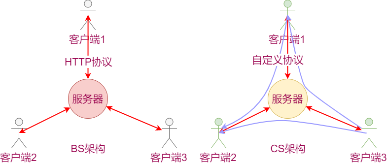
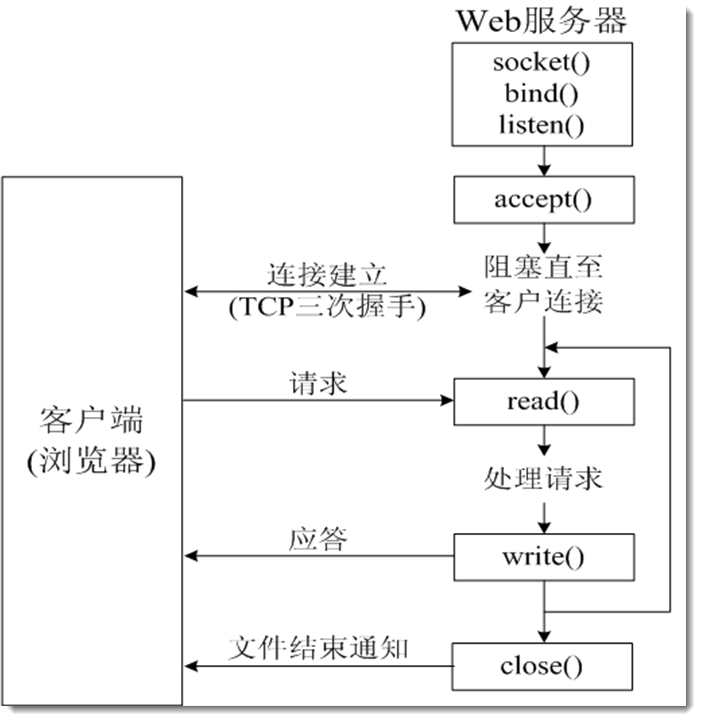
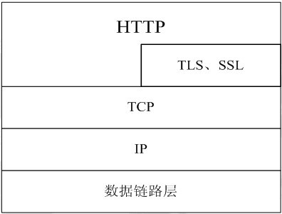
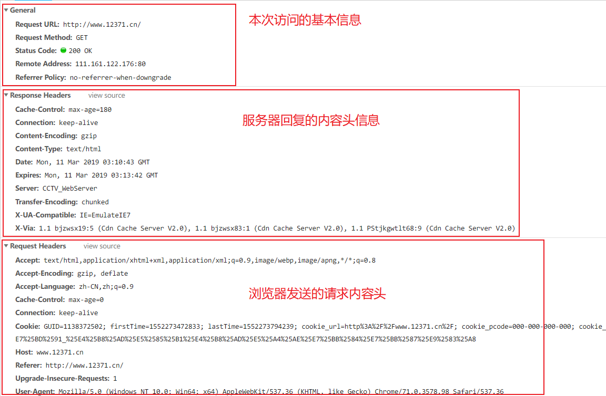

# 7 服务器架构BS及HTTP

接下来我们创建登陆服务器，用于管理游戏容器，向客户端回复登陆是否成功，房间是否创建成功或房间是否可以跟随。

**特点：**

- 效率要求低
- 每个客户端的请求都是独立处理的

> 这其实是典型的BS架构的服务器需求

### 登陆服务器架构选择 

- BS架构
- 效率要求不高，客户端向和服务器之间的数据交互比较单一：一条请求对应一条回复
- http协议承载数据

因为登录器只要发一次  不需要一直连接

**为什么要用HTTP？**

服务器的开发不容易，尤其是开发高性能、稳定性好服务器，更加不容易，因此人们尝试更好简单的方式来开发软件。

在服务器方面，使用Web服务器，采用HTTP协议来代替底层的socket，是常见的选择。采用HTTP协议更加除了能得到稳定的服务器支持外，更加可以兼容各种客户端（手机、PC、浏览器）等等。这样实现了一个服务器之后，多个客户端可以通用。

**HTTP是什么？**

超文本传输协议(HTTP，HyperText Transfer Protocol)是互联网上应用最为广泛的一种网络协议，它详细规定了浏览器和万维网服务器之间互相通信的规则，通过因特网传送万维网文档的数据传送协议。

HTTP协议通常承载于TCP协议之上，有时也承载于TLS或SSL协议层之上，这个时候，就成了我们常说的HTTPS。如下图所示：

HTTP协议的特点：

- 支持C/S架构
- 简单快速：客户向服务器请求服务时，只需传送请求方法和路径，常用方法：GET、POST
- 灵活：HTTP允许传输任意类型的数据对象
- 无连接：限制每次连接只处理一个请求
- 无状态：即如果后续处理需要前面的信息，它必须重传

**实例：**

1. 打开Chrome浏览器，按下F12，弹出调试界面。
2. 访问`http://www.12371.cn/`（中共中央组织部官网）
3. 查看调试界面

**小结**

HTTP是基于文本传输的通信协议。

- 在请求报文中包含：
  - 请求的类型：GET或POST
  - 请求的资源路径：Request URL
  - 一些额外数据
- 在回复报文中包含
  - 请求状态码：`Status Code: 200 OK`
  - 回复给浏览器的内容：html文件内容（静态网页），JS脚本（网页交互逻辑），媒体数据（图片等）
  - 相关的额外数据

自己写http服务器不是好的选择。

# http协议

- 超（基于字符编码多媒体）文本（字符串）传输（基于短连接tcp）协议
- 请求或回复头： 属性名：属性值 http请求（浏览器---》服务器）
  - GET请求（只有请求头）
  - POST请求（头+身体）：头和身体直接有两个回车
- http回复（服务器---》浏览器）
  - 类型决定于请求类型
  - 包含头和身体
  - 头：状态吗（200---》成功）
  - 身体：html文件（显示为网页）

# **BS架构下典型的服务器模型：Nginx+Fastcgi**