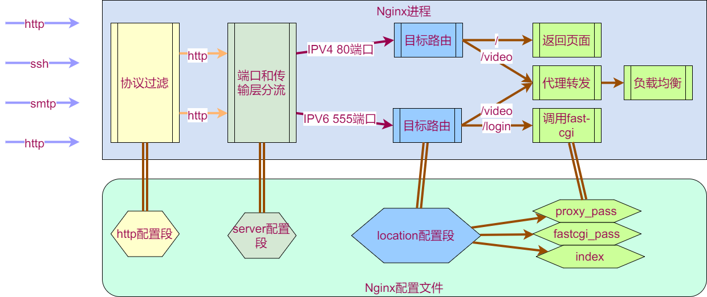
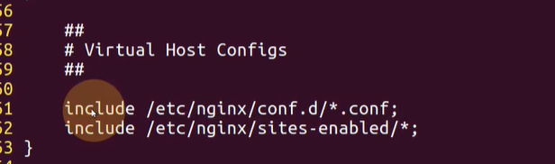
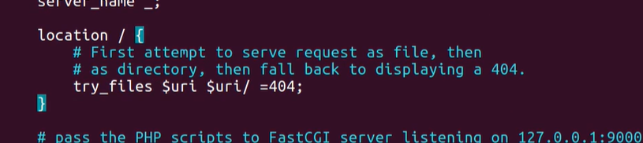
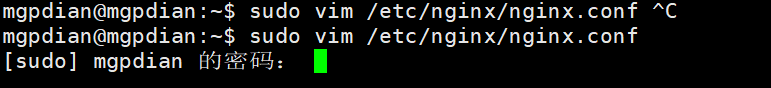
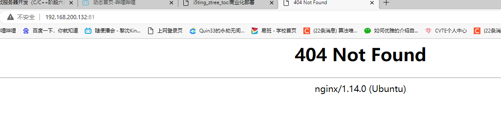
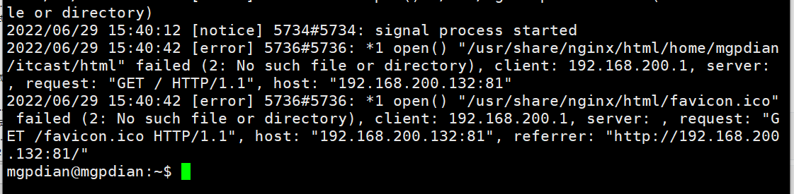
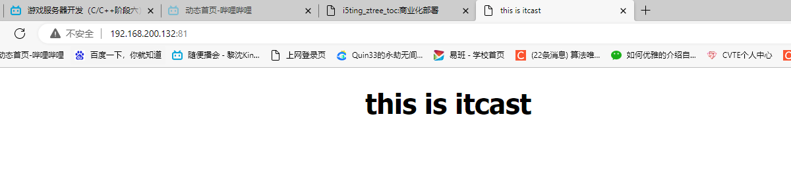
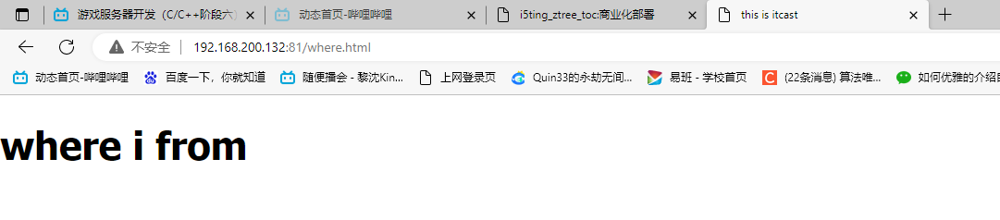

# 9 Nginx 配置静态页面

**Nginx配置方式**

Nginx配置文件结构：


| 配置层次     | 描述                                                 |
| -------- | -------------------------------------------------- |
| main     | Nginx在运行时与具体业务功能无关的参数，比如工作进程数、运行身份等                |
| http     | 与提供http服务相关的参数，比如keepalive、gzip等                   |
| server   | http服务上支持若干虚拟机，每个虚拟机一个对应的server配置项，配置项里包含该虚拟机相关的配置 |
| location | http服务中，某些特定的URL对应的一系列配置项                          |
| mail     | 实现email相关的SMTP/IMAP/POP3代理时，共享的一些配置项               |

配置文件的生效阶段：



**重点关注server配置项和location配置项**

通过不同的配置可以将nginx作为不同的角色使用。



配置文件中该部分就是 server的内容  server在nginx中 就是一个虚拟机  它在配置时会使用include将下面的内容进行展开 (展开内容才是要配置的对象)

核心配置是: /etc/nginx/sites-enabled/default(因为文件夹里面只有这一个 所以*无所谓)


这是配置中 监听的端口  ([::]: 是ipv6的监听端口)



这是监听到后指定的URL处理  /的意思是默认(啥也不写的情况)

### 练习

#### 使用nginx 配置静态页面

创建`itcast.html`为

```html
<!DOCTYPE html>
<html>
<head>
<title>this is itcast</title>
<style>
    body {
        width: 35em;
        margin: 0 auto;
        font-family: Tahoma, Verdana, Arial, sans-serif;
    }
</style>
</head>
<body>
<h1>this is itcast</h1>
</body>
</html>
```

修改`/etc/nginx/nginx.conf`为

```c++
sudo vim /etc/nginx/nginx.conf
```



在 http里 添加 server 端口监听 和 location url处理 即可

```
server {
        listen 80;
        location / {
            index  /home/mgpdian/itcast.html;
        }
    }
```

配置完成后 

测试语法是否没问题

```c++
sudo nginx -t
```

然后重启

```C++
sudo nginx -s reload
```

然后发现404了



寻找问题

```c++
cat /var/log/nginx/error.log
```



猜想没有设置相对路径

修改

```c++
server{
                root /;  //设置路径
                listen 81;
                location /{
                        index  /home/mgpdian/itcast.html;

                }
        }
```

运行成功



添加功能 可以根据url跳到别的网页

我们可以指定默认的路径  之后nginx会根据url 来在该路径下寻找文件

除了默认()

```c++
 server{
                root /home/mgpdian;
                listen 81;
                location /{
                        index  itcast.html;

                }
        }
```



### nginx配置静态页面

- 创作一个html文件

- 将html文件放到server配置段指定的root目录下

- location配置段：index html文件名（指定首页）

- 浏览器输入192.168.64.148/XXXX.html----->服务器会向浏览器返
  
  回XXXX.html的内容
